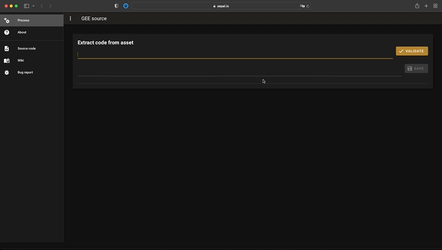

# GEE source

[](https://github.com/12rambau/gee_source/blob/master/LICENSE)
[](https://github.com/psf/black)

## About

> The application is currently in beta testing 

Extract source code from any GEE app URL. This function is inspired by the work from @samapriya in the [geeadd lib](https://github.com/samapriya/gee_asset_manager_addon/blob/master/geeadd/app2script.py). The source code of the app is extracted from the url and display to the end user. 

The user can then save it to the `module_result/gee_source` directory clicking on the save button



## installation

copy the repository on your computer: 

```
git clone https://github.com/12rambau/gee_source
```

then execute `ui.ipynb` with voila.

> If you're not installing it on SEPAL the requirements can be found in requirements.txt
